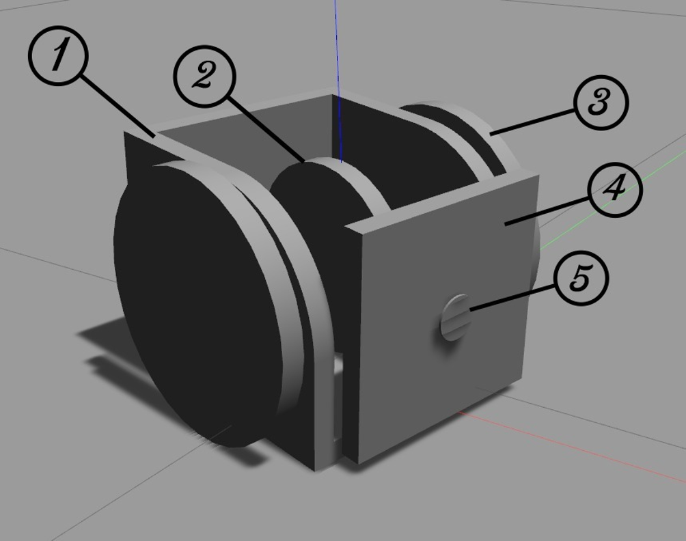

# MSRR
### A simple simulation for a two wheeled differential robot that has the ability to attach with other similar robots and can take many forms each with different functionalities.

What you need to know to get the simulation working:
The codes are divided in two main packages gp_abstract_sim and simple_keys.
Terminal Commands: 
<ol type="i">
  <li>roslaunch gp_abstract_sim start_testworld.launch</li>
  <li>roslaunch gp_abstract_sim spawn_sdf.launch robot_name:="your robot name"</li>
  <li>rosrun simple_keys readwrite_keys</li>
  <li>rosrun simple_keys readStringAndCut</li>
</ol>

1)	roslaunch gp_abstract_sim start_testworld.launch
This command is for starting an empty Gazebo world. This node takes no arguments.

2)	roslaunch gp_abstract_sim spawn_sdf.launch robot_name:="your robot name"
This launch file is for spawning the modules into the world that you started from command no.1 this launch file takes the following arguments:
    -	robot_name: for naming the robot in the simulation (no default you must specify)
    -	x: Position x of the robot center by reference to world (default 0)
    -	y: Position y of the robot center by reference to world (default 0)
    -	z: Position z of the robot center by reference to world (default 0)
    -	roll: Rotation angle x in reference to world frame (default 0)
    -	pitch: Rotation angle y in reference to world frame (default 0)
    -	yaw: Rotation angle z in reference to world frame (default 0)
    -	sdf_robot_file: The path to where the SDF model is stored on your computer (default is set to the path on our test computer)

3)	rosrun simple_keys readwrite_keys
This node runs in the terminal and controls the modules by the keyboard but you must not leave the terminal (the terminal running this node must not lose focus) or the keyboard keys won’t control the module. The following keys are the only keys that work:
    -	W: move forward
    -	S: stop the module
    -	X: move backward
    -	A: rotate left
    -	D: rotate right
    -	Q: forward left
    -	E: forward right
    -	Z: backward left
    -	C: backward right
    -	U: rotates the tilting mechanism up
    -	J: rotates the tilting mechanism down
    -	M: stops the tilting mechanism

4)	rosrun simple_keys readStringAndCut
This node takes the contact sensors readings and sends signals to the modules to connect them together through topics. This node takes no arguments.

The Plugins used in the model are all written from the ground up to match our model’s special specifications as this model has some very special features such as magnetism which is not implemented in any of the physics engines used by Gazebo and these plugins are called internally and loaded with the spawning of the model in the world.
The plugins are:
1.	my_speed_controller_plugin
2.	ContactPlugin

1)	my_speed_controller_plugin
This is the main plugin in the module which contains subscription nodes that does the following:
-	controls the motion
-	controls which face attaches to which other module’s face
-	controls the tilting mechanism
and this happens through four subscription nodes which are:
1.	module_name/right_wheel_speed as the name implies controls the speed of right wheel (arguments are in float)
2.	module_name/left_wheel_speed as the name implies controls the speed of the left wheel (arguments are in float)
3.	module_name/front_face_speed this topic controls the front face tilting movement
(arguments are in float)
4.	module_name/attach takes the name of the two sides to be linked (arguments in String)

2)	ContactPlugin
This plugin is connected to the magnets on the model it also starts with the summoning of the model this plugin is connected to a contact sensor on the faces of the model when this sensor collides with anything in the world it checks what that object is if that object is other module’s collision sensor and this sensor is a small enough in order to make accurate docking.
This plugin creates the sensor_data node which sends a string with the names of the collided links which is received by the readStringAndCut node to process it and send to the my_speed_controller_plugin node to connect them if accepted as attachable nodes.

1)	The main body of the robot
2)	The tilting mechanism
3)	The wheels
4)	Front face
5)	Front face magnet

There is another magnet at the back of the body other magnets to be added to the side wheels for full 3d lattice achievement, also it is too simplified masses and inertias to be adjusted and pan mechanism to be added in order to achieve more realistic motion. Material is not specified as we are constantly changing it until we find the optimum one and changing its friction and the ground friction to match the terrain it is navigating through.
